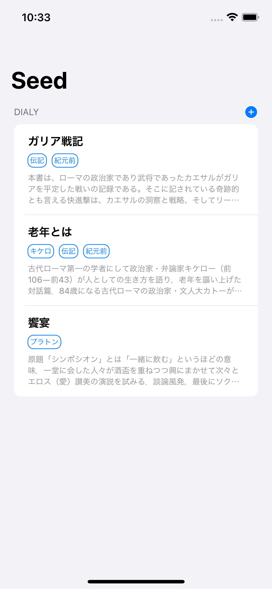

# 🌱Seed

## 📱Screens

| 🌞 | 🌙 |
|:--:|:--:|
|||
## 🏗Architecture

[The Composable Architecture](https://github.com/pointfreeco/swift-composable-architecture)

### Projects

* `Debug.xcodeproj`, `Production.xcodeproj`環境を分けている
* 各ページの機能をモジュール化して[Package.swift](./Package.swift)にて管理

## 🥞DB

[Firebase](https://github.com/firebase/firebase-ios-sdk/tree/master/Firestore)

## Reference

* [isowords](https://github.com/pointfreeco/isowords)
* [DoroidKaigi-iOSApp](https://github.com/DroidKaigi/conference-app-2021)